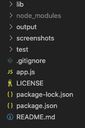

# Team contact creator [](https://opensource.org/licenses/MIT)

## Table Of Contents

1. [Description](#description)

2. [Installation](#installation)

3. [Usage](#usage)

4. [Testing](#testing)

5. [Questions](#questions)

6. [License](#license)

## Description

The project is designed for usage by programmers who just got a new job and wants to have all the contacts of his team members organized in one place.


Folder structure is below.



## Installation

In order to instal the program you need to clone the whole repository on your computer by inserting in your bash the next command:

```bash
git clone git@github.com:paveldarii/team-creator.git
```

After you cloned everything, you will need to insert the next command in order to start the whole functionality:

```bash
npm i
```

Congratulations, you just installed the app on you computer.

## Usage

To start the application enter in the team-creator directory; then, run the next command;

```bash
node app.js
```

By answering the questions that just prompted out on your terminal, you will be able to create the profile for each of your team members.

After you inserted all team members, answer no to the last question wether you need to add more team mates, and you will find that you just created a new team.html file in the folder named output.

## Testing

Four javascript files that are located in lib folder are tested by the test applications located in test folder:
When you are in team-creator directory run the next command in order to test those four javascript files:

```bash
npm run test
```

## Questions

My GitHub profile: [https://github.com/paveldarii](https://github.com/paveldarii).

My email address: paveldarii@yahoo.com

## License

[The MIT License](https://opensource.org/licenses/MIT/)
